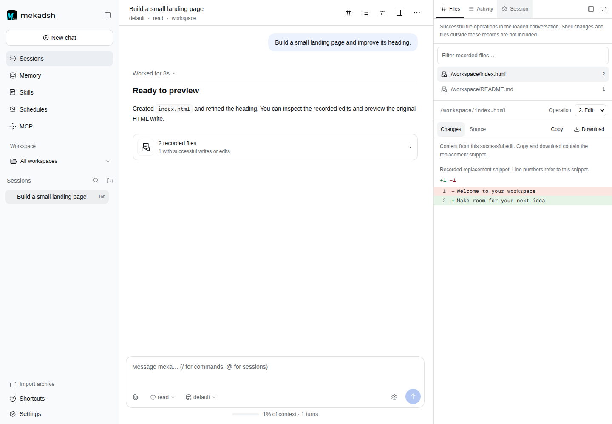

# mekadsh

A static web frontend for [meka](https://github.com/k4yt3x/meka), with the look of
[DeepSeek Harness](https://github.com/deepseek-ai/deepseek-harness) and functionality
from [mekaweb](https://github.com/k4yt3x/mekaweb).

Chat with your agent, follow tool activity, respond to approvals, and manage
sessions, memory, skills, schedules, and MCP servers.



*The screenshot uses demo conversation data.*

## Workspace features

- **Files:** inspect successful file reads, writes, and edits recorded in a
  conversation. Compare edit snippets, preview Markdown or static HTML, and copy
  or download the available content.
- **Activity:** search and filter saved/live messages and tool calls, inspect
  inputs and results, and load earlier history.
- **Session:** view context usage, background tasks, child agents, and schedules.
- **Composer:** type `/` for skills, profiles, and permission choices, or `@` to
  insert a session name and ID. Session references do not attach its messages.
- **Workspaces:** filter sessions by server directory and start a chat there.

Open the workspace panel from the conversation header. Its tabs support arrow-key
navigation; on desktop, drag the divider to resize or expand the panel. On mobile,
views open in a dialog.

These features use the existing meka API. Files shows recorded content, not a live
file browser or a complete Git diff. HTML previews disable scripts and external
resources. Activity timestamps describe message persistence, not execution timing.

## Run locally

Requires **Node.js 24 or newer** and a running meka server.

```sh
git clone https://github.com/Avimitin/MekaDsh.git
cd MekaDsh
npm ci
npm run dev
```

Open the URL printed by Vite (usually `http://localhost:5173`). Enter your meka
**Server URL** and **API token**, then click **Connect**.

Use the server's base URL, without `/v1`. If your reverse proxy serves meka under
`/api/`, enter a URL such as `https://meka.example.com/api/`. When the frontend and
API have different origins, configure meka to allow the frontend origin through
CORS. An HTTPS frontend also needs an HTTPS API.

## Build and host

```sh
npm run build
npm run preview
```

The build outputs static files to `dist/`. `npm run preview` lets you check the
build locally. For deployment, serve `dist/` with a static web server. The browser
connects directly to meka's HTTP and SSE API; the frontend does not include the
meka daemon. If proxying the API, disable response buffering for SSE streams.

### Nix

```sh
nix develop  # Enter a shell with Node.js 24
npm ci
npm run dev
```

To build the static site with Nix, run `nix build`. The output is available at
`result/`.

## License

[AGPL-3.0-or-later](LICENSE). See [third-party notices](THIRD_PARTY_NOTICES.md) for
upstream code, design, and font licenses.
